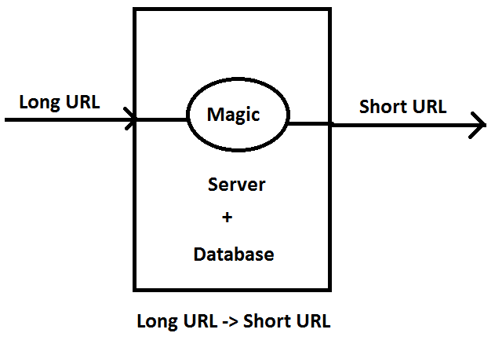
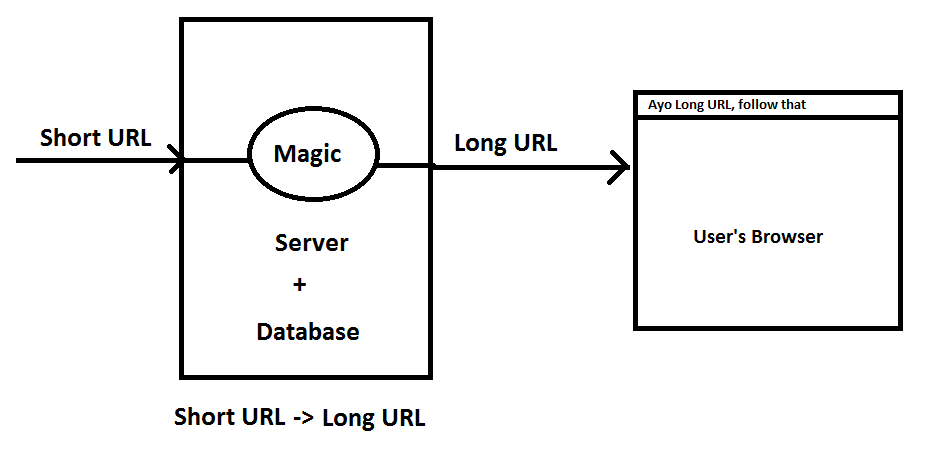

# Rex-URL-Shortener

As you have already guessed, Rex URL Shortener is a url shortenting website. I made this this website to learn about backend and databse. I used Node JS, Express JS, MySQL and more technologies to make to this project. <br/>
By the way, I have written the whole documentation to install and use this project. <br/>
It was just a fun project, but hey if you find something that I should change feel free to send a pull request. <br/>
Have Fun Guys !!! <br/>
<br/>
Here is the live website link: https://rex-url-shortener.onrender.com/ <br/>
Please try to open it in PC, I am not a big frontend guy.
<br/>

## Table of Context

- [Design](#design)
  - [Backend Design](#backend-design)
  - [Database Design](#database-design)
- [Setup](#setup)
- [Run](#run)

## Design

- ### Backend Design
   <br/>
  _Figure 1: LongURL -> ShortURL_ <br/><br/><br/>
   <br/>
  _Figure 2: ShortURL -> LongURL_ <br/><br/>
- ### Database Design
   <br/>
  _Figure 3: DataBase Design_ <br/><br/>

## Setup

- First of all, clone the project on your local machine or open it in codespace.
  ```
  git clone https://github.com/IRFANSARI/Rex-URL-Shortener.git
  cd Rex-URL-Shortener
  ```
- Copy the whole SQL code from Schema/DataBase_Schema.sql.
- Start the MySQL server and run the copied SQL code to make the database which we will use in the project.
- Now go to the project directory and make a new environment name `.env`, nothing else just .env name file.
- Paste the following code in that file.

  ```
  URL = http://127.0.0.1:8080/
  PORT = 8080

  DB_HOST = {database_host}
  DB_PORT = {database_PORT}
  DB_USER = {database_user}
  DB_PASS = {database_password}
  DB_NAME = {database_name}
  ```

  If you are new, let me tell you these are secret information that should not be pushed on GitHub or told to anybody else.

- Now, let's install the dependencies of the project just copy and paste this command to do that.
  ```
  npm install
  ```
- Now, you are all set to run the server.

## Run

- To run the Node server, just write `npm start`.
- If you want to run the server using nodemon use the command `npm run dev`.

At last, I would really like to thank you (yes you) for reading all this nonsense stuff. <br/>
See you around, signing out....
