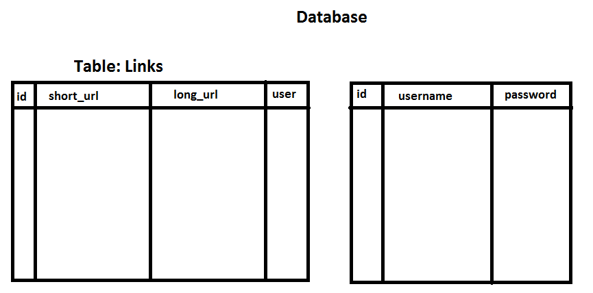

# Rex-URL-Shortener
As you have already guess, Rex URL Shortener is a url shortenting website. I made this this website to learn about backend and databse. I used Node JS, Express JS, MySQL and more technologies to make to this project.  
By the way, I have written the whole documentation to install and use this project.  
It was just a fun project, but hey if you find something that I should change feel free to send a pull request.  
Have Fun Guys !!!  
 
Here is the live website link: https://rex-url-shortener.onrender.com/  
Please try to open it in PC, I am not a big frontend guy.
 

## Table of Context
- [Design](#design)
  - [Backend Design](#backend-design)
  - [Database Design](#database-design)
- [Setup](#setup)
- [Run](#run)

## Design
- ### Backend Design
  
  
- ### Database Design
  
  
## Setup

## Run

At last, I would really like to thank you (yes you) for reading all this nonsense stuff.  
See you around, signing out....
